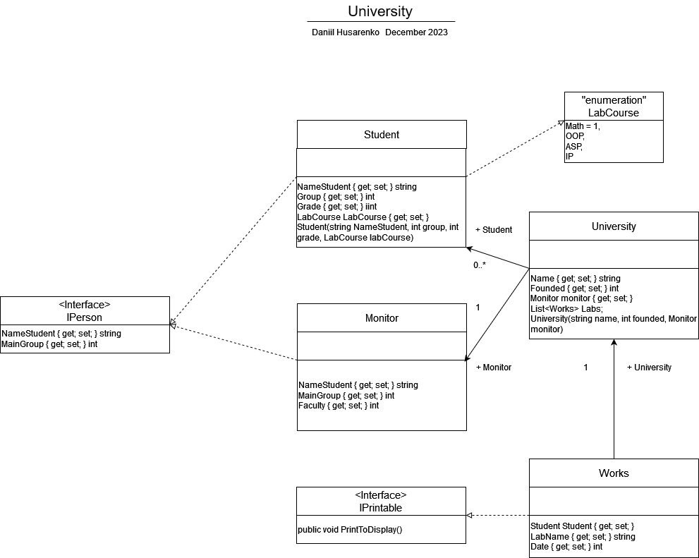

# 🎓University
**Ідея проекту**: Збереження даних про університет, студентів та їхні лабораторні роботи.

Діаграма класу:

## Опис класів

- **PersonBase**: Абстрактний базовий клас для представлення основних властивостей та методів для студента або старости.
- **Student**: Клас, який наслідується від PersonBase і реалізує властивості та методи, специфічні для студента.
- **Monitor**: Клас, який також наслідується від PersonBase і реалізує властивості та методи, специфічні для старости.
- **University**: Клас, який представляє університет і має методи для додавання студентів та лабораторних робіт, а також виведення інформації про університет та студентів.
- **Works**: Клас, який представляє лабораторну роботу та вміє виводити інформацію про неї та студента.
- **IPerson**: Інтерфейс для стандартизації властивостей осіб (студентів та старост).

